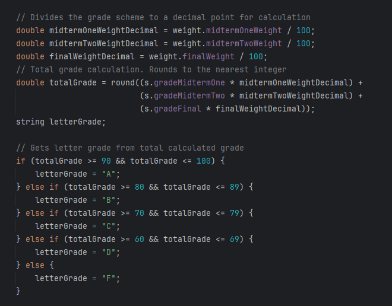

[](https://classroom.github.com/a/adCxbDim)


# Student Information System

This program allows you to add, delete, edit or print student information saved to a .txt file.
The project was created in an IDE called CLion.

## Main Menu

The main.cpp calls the start() method which prints the menu from which the user chooses a function to run.

```
Please enter the number of your selection.
--------------------------------------------------
1) Print all Student data
2) Sort the list of students in alphabetical order by last name
3) Add new student
4) Calculate the letter grade of all students
5) Change the information of a specific student
6) Print the data of a specific student
7) Remove a student from the list
8) Delete ALL student data
9) Change grading scheme
10) Exit
--------------------------------------------------
>
```

## Print All Students

This function sorts the students by student ID and prints all informaion stored in the Student vector.

## Sort Alphabetically

This function sort the students alphabetically by last name. If any students have the same last name they are sorted based on their first name.

## Add New Student

This function lets the user add a new student to the vector and .txt file using the struct values of _studentID_, _firstName_, _lastName_, _gradeMidtermOne_, _gradeMidtermTwo_, and _gradeFinal_.

## Calculate Letter Grade

This function takes the grading weight scheme values from the Weight vector and the grades from the Student vector and calculates the total grade for each student. That total is then used to determine the student's letter grade.



All students are then printed with their total grade and letter grade.

## Change Student Information

This function lets the user select a specific student using the saved _studentID_ and edit any value, except the _studentID_, for that student and saves the change to the .txt file.

## Print Specific Student

This function lets the student select a specific student using the saved _studentID_ and print only their information.

## Remove Student

This function lets the user remove a student from the vector using the saved _studentID_. The altered student information from the vector is then used to save over the students.txt file.

## Delete All Student Data

This function lets the user clear the Student vector and delete the students.txt file.

## Change Grading Scheme

This function displays the current grading scheme and confirms if the user would like to change it. If changed the grading-scheme.txt file is resaved and the Weight vector values are overwritten.

## Exit

This function letx the user close the program.

## Load Student Vector

Upon running the program it takes the data saved in the students.txt file and adds it to the Student vector. If there is no students.txt file the program lets the user know the file is missing and to add students.

## Check Grading Scheme

Upon running the program it checks for a grading-scheme.txt file. If the grading-scheme.txt file does not exist the program creates one using default grading weights.

## Load Weight Vector

Upon running the program it takes the data saved in the grading-scheme.txt file and adds it to the Weight vector.